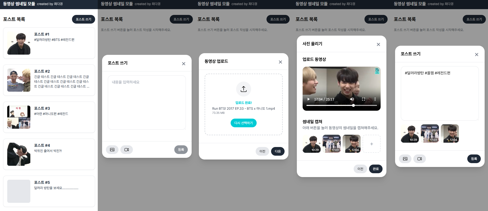

# 🎬 동영상 썸네일 모듈

게시글 작성 중 사용할 수 있는 **동영상 썸네일 추출 모듈**입니다.  
React + Vite + TypeScript 기반으로 개발되었으며,  
**동영상 첨부 → 썸네일 추출 및 선택 → 게시글 반영**까지의 흐름을 제공합니다.



## 1. 기술 스택

| 범주      | 사용 기술                 |
| --------- | ------------------------- |
| 기본 세팅 | React + Vite + TypeScript |
| 스타일링  | TailwindCSS               |
| 상태관리  | Zustand                   |
| 배포      | Vercel                    |
| 테스트    | Vitest                    |

## 2. 브랜치 전략

본 프로젝트는 다음과 같은 브랜치 구조 및 명명 규칙을 따릅니다.

### 기본 브랜치

| 브랜치명  | 설명                       |
| --------- | -------------------------- |
| `main`    | 최종 제출 및 배포용 브랜치 |
| `develop` | 기능 개발 통합 브랜치      |

### 작업 브랜치 규칙

| 타입      | 네이밍                 | 설명                                  |
| --------- | ---------------------- | ------------------------------------- | --- |
| 초기 세팅 | `chore/init-project`   | 프로젝트 초기 설정 및 공통 구조 구성  |
| 기능 구현 | `feat/post`            | 게시글 작성 관련 UI 및 흐름 구현      |
| 기능 구현 | `feat/video`           | 동영상 업로드 구현                    |
| 기능 구현 | `feat/post-thumbnail`  | 썸네일 추출 및 포스트 업로드 구현     |
| 리팩토링  | `refactor/post-module` | 모듈 단위 리팩토링                    |
| 테스트    | `test/post-module`     | 모듈 단위 테스트 코드 작성            | `   |
| 버그 수정 | `fix/vercel-deploy`    | 배포 시 발생한 버그 수정              |
| 문서 수정 | `docs/readme`          | readme파일 수정 및 가이드 문서 업로드 |

## 3. 폴더 구조

```text
src/
├── features/                  # 도메인 기반 폴더
│   ├── post/                  # 포스트 도메인
│   │   ├── components/        # PostModal, PostList 등 컴포넌트
│   │   ├── constants/         # 포스트 관련 상수
│   │   ├── hooks/             # usePostModal 등 상태 및 제어 관련 훅
│   │   └── types.ts
│   ├── video    /             # 비디오 도메인
│   │   ├── components/        # VideoPlayer, VideoUploader 컴포넌트
│   │   ├── constants/         # 비디오 관련 상수
│   │   ├── hooks/             # useVideoPlayer, useVideoUpload 훅
│   │   ├── utils/             # validateVideo, formatBytes 유틸 함수
│   │   └── types.ts           # 비디오 관련 타입
│   ├── thumbnail/             # 썸네일 도메인
│   │   ├── components/        # 썸네일 모달, 썸네일 리스트/아이템
│   │   ├── constants/         # 썸네일 관련 상수
│   │   ├── hooks/             # useVideoPlayer, useThumbnail 훅
│   │   ├── utils/             # captureThumbnail, formatTime 유틸 함수
│   │   └── types.ts           # 썸네일 관련 타입
├── shared/                    # 프로젝트 공통 작성
│   ├── components/            # 공통 UI 컴포넌트
│   │   ├── ui/
│   │   ├── layout/
│   │   ├── modal/
│   │   ├── toast/
│   ├── hooks/                 # 범용 커스텀 훅
├── stores/                    # Zustand 상태 관리 (포스트, 모달, 토스트)ㅖ
├── assets/                    # 폰트 등 정적 자원
└── main.tsx                   # 앱 엔트리 파일
```

## 4. 테스트 코드 작성 기준

본 프로젝트는 Vitest + @testing-library/react 기반으로 주요 기능 중심의 단위 테스트를 작성합니다.

### 테스트 실행

```bash
npm run test
```

### 테스트 환경

- 테스트 프레임워크: Vitest
- 렌더링 테스트: @testing-library/react
- DOM 환경: jsdom

### 테스트 작성 기준

- 테스트 파일은 **컴포넌트 또는 스토어 파일과 동일한 위치**에 `.test.tsx` / `.test.ts`로 작성
- **UX 흐름상 중요한 단계** 중심으로 테스트를 작성했으며, 상태 변화, 사용자 상호작용, 조건 분기 등을 검증했습니다.

| 파일                   | 설명                               |
| ---------------------- | ---------------------------------- |
| `PostDetailModal`      | 포스트 상세 모달 렌더링 테스트     |
| `PostList`             | 작성된 포스트 리스트 테스트        |
| `OpenPostModalButton`  | 모달 진입 버튼 렌더링 테스트       |
| `PostModalContent`     | 모달 내 단계 전환 및 콘텐츠 테스트 |
| `FormStep`             | 텍스트 입력 단계 테스트            |
| `VideoStep`            | 동영상 업로드 단계 테스트          |
| `VideoPlayer`          | 동영상 재생 UI 및 ref 전달 테스트  |
| `VideoUploader`        | 파일 업로드 및 validation 테스트   |
| `ThumbnailStep`        | 썸네일 선택 및 삭제 테스트         |
| `ThumbnailPreviewGrid` | 썸네일 미리보기 UI 테스트          |
| `ThumbnailSeekGrid`    | 썸네일 탐색용 UI 테스트            |
| `postDraft.store`      | 포스트 작성용 상태 로직 테스트     |

## 5. 주요 기능

- **동영상 업로드**: Drag & Drop 또는 버튼 클릭으로 동영상 업로드
- **업로드 검증**: 파일 형식 및 용량(100MB 이하) 유효성 검사
- **썸네일 추출**: 재생 중 원하는 타임스탬프에서 썸네일 추출
- **썸네일 관리**: 추출된 썸네일 미리보기, 삭제, 선택
- **게시글 작성**: 텍스트 + 썸네일 조합으로 게시글 작성 및 리스트 관리
- **반응형 UI**: 썸네일 리스트가 디바이스 너비에 따라 1~3열로 변경

## 6. 배포 링크

- https://dgchoi-video-thumb.vercel.app/

## 7. 실행 방법 및 가이드 안내

- 가이드 문서는 루트 폴더 내에 **모듈 가이드 및 동작 샘플.pdf** 문서를 참조합니다.

```bash
npm install
npm run dev
```
